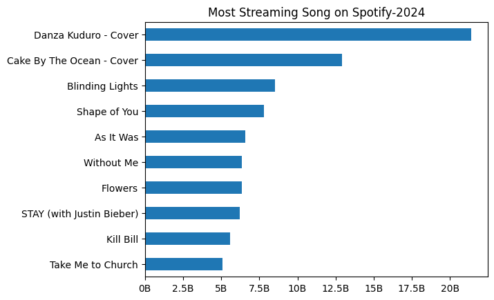
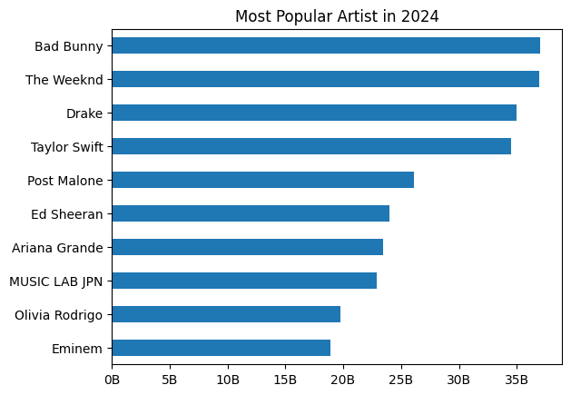
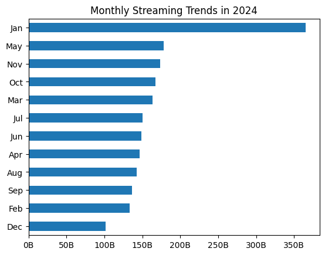
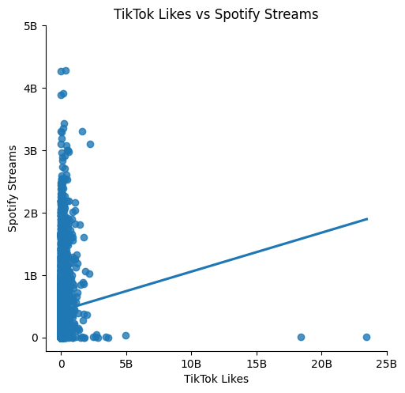

# 🎧 Spotify 2024 Streaming Trends: Do Viral Platforms Drive Music Streams?

## 📌 Objective

This project aims to:
Analyze song trends on Spotify in 2024
Analyze is there correlation between social media platforms with spotify music streams
Analyze cover song
---

## 📊 Dataset

* Source: Kaggle
* Dataset: Most Streamed Spotify Songs 2024
* Records: 4598 songs
* Features: Streaming data from Spotify, TikTok, YouTube, and other platforms

---

## 🧹 Data Cleaning

The following steps were performed:
* Read the data
* Converted string columns with commas into numeric values
* Removed irrelevant columns (e.g., TIDAL Popularity)
* Handled missing values using median imputation
* Converted release date into datetime

---
## 🔍 Key Insights

### 🎵 Top Songs
Danza Kuduro and Cake by the Ocean are among the most frequently covered songs in the dataset, indicating their enduring popularity across different artists.
Meanwhile, Blinding Lights and Shape of You rank among the top streamed songs on Spotify based on total plays.

### 🎵 Top Artists

Artists like The Weeknd and Bad Bunny dominate Spotify streams, showing strong global reach and consistent popularity.

---

### 📅 Release Timing Matters

Songs released in certain periods (e.g., early in the year) tend to show higher average streaming numbers, suggesting that release timing may influence overall performance

---

### 📱 TikTok Impact (Unexpected Finding)
The correlation between TikTok engagement (views and likes) and Spotify streams is very weak (0.044 and 0.057), indicating little to no relationship between the two platforms. In contrast, Spotify-related metrics such as playlist reach show a much stronger correlation with streaming numbers (0.79), suggesting that internal platform exposure plays a more significant role in driving streams.
👉 This shows us that viral content on TikTok does not necessarily translate into higher Spotify streams.

Overall, the analysis highlights that platform-specific factors (such as Spotify playlists) may have a stronger impact on streaming performance than external viral platforms.
—

## 📈 Visualizations

### 🎵 Top Songs

### 🎵 Top Artists

### 📅 Monthly Streaming Trends in 2024

### TikTok vs Spotify

* Spotify Count vs Streams

---

## 🧠 Conclusion

The finding shows that Top Streamed Song tends to be like Top Cover Song too.  However, viral performance on platforms like TikTok does not show a strong relationship with Spotify streaming outcomes in this dataset.
---

## 🛠 Tools Used

* Python (Pandas, Matplotlib)
* Google Colab

---

## 🚀 Future Improvements

* Add machine learning model to predict song popularity
* Build interactive dashboard using Tableau or Power BI

---

